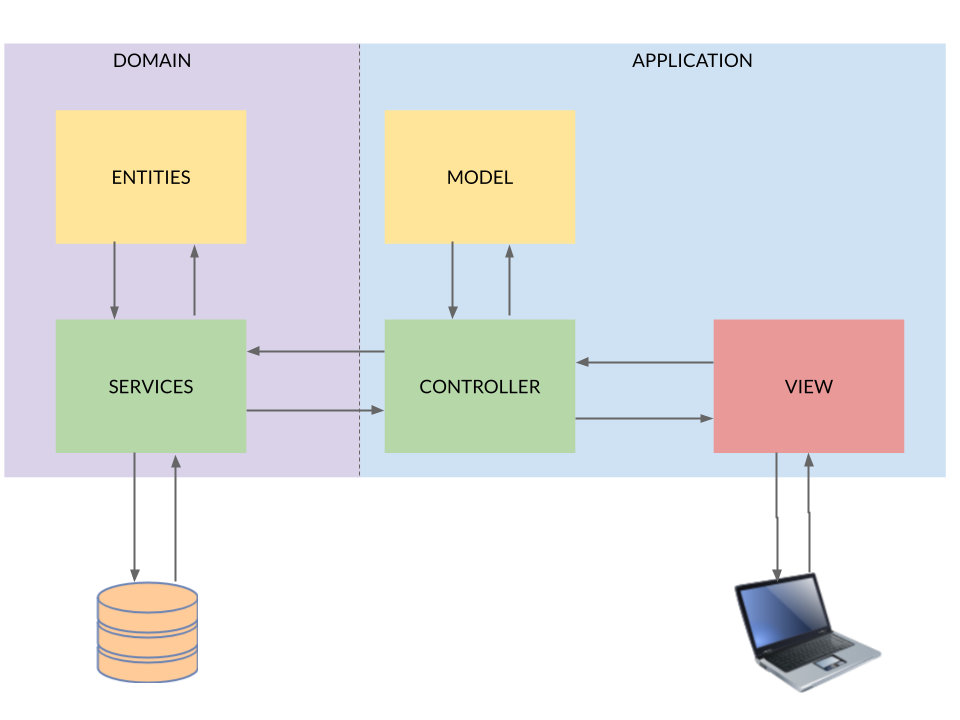
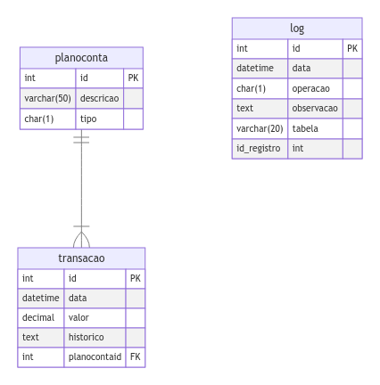

# My Finance Web
Projeto para controle de finanças pessoas


O **My Finance** é um projeto desenvolvido em Aspnet MVC que tem como objetivo oferecer um controle financeiro pessoal, permitindo o registro de transações e categorizando-as dentro de um plano de conta. Como features adicionais, foram inseridos um alerta para confirmação de exclusão de itens pelo usuário e o registro de logs no banco de dados para todas as operações de escrita.


### Tecnlogias utilizadas
<p align="left" style="'margin':'50px'">
    <a href="https://dotnet.microsoft.com/pt-br/" targer="_blank"></a>
    &nbsp
    &nbsp
    <a href="https://hub.docker.com/_/microsoft-mssql-server" targer="_blank"></a>
    &nbsp
    &nbsp
    <a href="https://www.microsoft.com/pt-br/sql-server/sql-server-2022" targer="_blank"></a>
</p>


## Arquitetura da solução

A arquitetura do projeto é baseada em MVC com a separação em duas camadas com suas responsabilidades distintas:

- Aplicação
    - Responsável por processar as entradas de usuários, efetuar a lógica da aplicação e tomar decisões sobre as saídas de informações.
- Domínio
    - Responsável por representar os conceitos do mundo real e as regras de domínio do problema. 



## Modelo de entidade e relacionamentos (MER)



## Execução
O projeto foi desenvolvido para ser executado localmente, e por isso não há uma estrutura de deploy definida. Para executar o projeto cerifique-se de possuir o [.NET 6.0](https://dotnet.microsoft.com/pt-br/download/dotnet/6.0) e o [Docker](https://docs.docker.com/engine/install/) instalados.
Após clonar o repositório execute comando:

``` zsh
~$ docker-compose up
```
Com o container do SQL Server rodando, conecte-se ao banco e  execute as queries disponíveis nos arquivos [docs/myfinance-queries.sql](/docs/myfinance-queries.sql) e [docs/feature-extra-query.sql](/docs/feature-extra-query.sql). Após executar as queries, execute o projeto com o seguinte comando


``` zsh
~$ dotnet run watch 
```

## Detalhes da implementação da API de Logging do .NET


``` c#
    public class CustomLoggerConfiguration
    {
        public int EventId {get;set;} = 0;

        public LogLevel LogLevel {get;set;} = LogLevel.Information;
    }
```

``` c#
    public sealed class CustomLogger : ILogger
    {
        private MyFinanceDbContext _context = new MyFinanceDbContext();
        public string name;


        public CustomLogger(string name)
        {
            this.name = name; 
        }

        public IDisposable? BeginScope<TState>(TState state) where TState : notnull => null;  // Para essa feature os escopos de logs não serão abordados

        public bool IsEnabled(LogLevel logLevel) => true; // Para essa feature o log estará sempre habilitado

        public void Log<TState>(LogLevel logLevel, EventId eventId, TState state, Exception? exception, Func<TState, Exception?, string> formatter)
        {
            //Implementa lógica para escrever logs no console e também no banco de dados
        }

        public void Dispose(){
            _context.Dispose(); // Libera recursos da instância do banco de dados
        }
    }
```


``` c#
    public sealed class CustomLoggerProvider : ILoggerProvider
    {
        
        private readonly ConcurrentDictionary<string,CustomLogger> _loggers = new ConcurrentDictionary<string, CustomLogger>();

        public ILogger CreateLogger(string categoryName)
        {
            return _loggers.GetOrAdd(categoryName,name => new CustomLogger(name)); //Cria ou recupera a instância de log com a categoria definida;
        }

        public void Dispose()
        {

            foreach(var logger in _loggers){

                if (logger.Value is CustomLogger){
                    logger.Value.Dispose(); //Libera recursos dos logs criados
                }
                
            }
            _loggers.Clear(); // Limpa dicionário e logs
        }
    }
```

```c#
    public static class CustomLoggerExtensions
    {
        public static ILoggingBuilder AddCustomLoger(this ILoggingBuilder builder)
        {
            builder.AddConfiguration();
            builder.Services.TryAddEnumerable(ServiceDescriptor.Singleton<ILoggerProvider,CustomLoggerProvider>());

            LoggerProviderOptions.RegisterProviderOptions<CustomLoggerConfiguration,CustomLoggerProvider>(builder.Services);
            
            
            return builder;

        }
    }
```


```c# 
builder.Logging.AddCustomLoger();
```